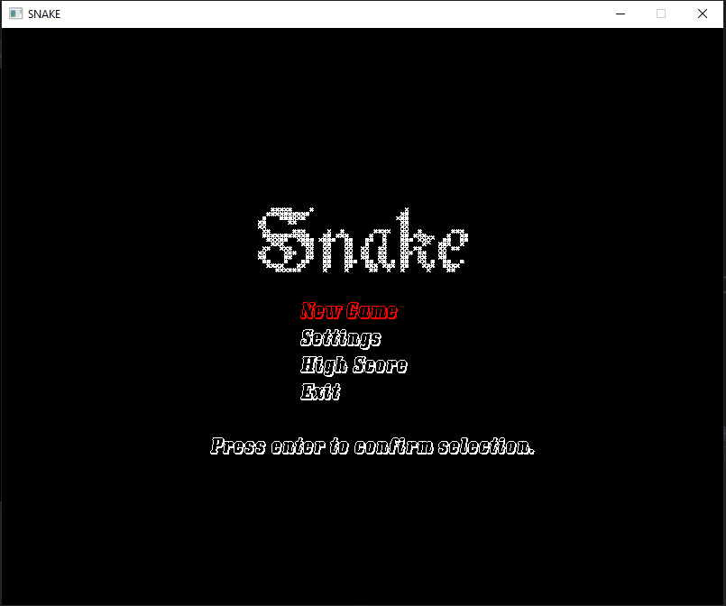
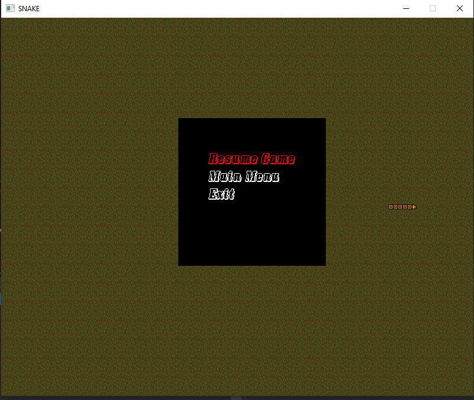
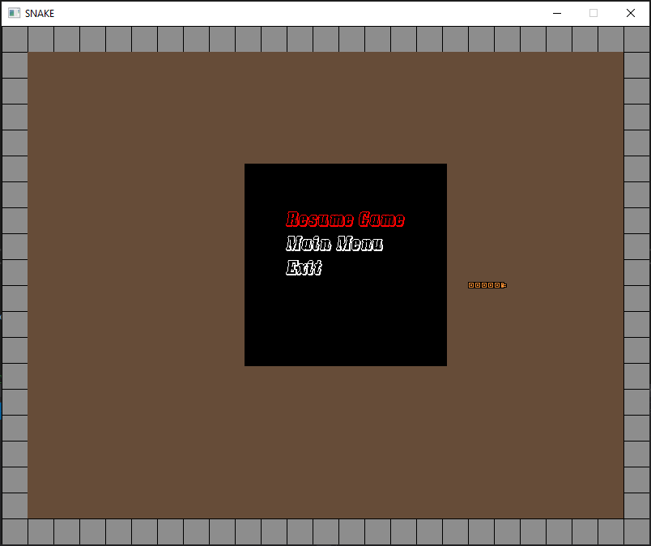

# Udacity Capstone (Snake Game)

This project contains the code for my udacity capstone project.
The project is a snake game built in c++, the project contains 6 screens
* Home screen.
* Game screen.
* Highscore screen.
* Games settings screen.
* map settings screen.
* difficulty settings screen.

## Rubric Pounts
*Loops, Functions, I/O
  *1-This can be observered through out the project
  *2-This is addressed in DataProvider.cpp and TextObject.cpp files (line 24 -> setText(...))
  *3-The program using the w,a,s,d,esc and enter key to navigate screen options and move the snake object.
     This is addressed in the Controller.cpp file (line 447 captureInput())
*Object Oriented Programming
   *1-This can be observered in the src folder where the program components are grouped into classes.
   *2-This can be observered in all header files in src folder.
   *3-This can be observered in Snake.cpp (line-9), TextObject.cpp(line-6), Controller.cpp(line-8) and FoodManager.cpp(line-9)
   *4
 

## Dependencies for Running Locally
* cmake >= 3.7
  * All OSes: [click here for installation instructions](https://cmake.org/install/)
* make >= 4.1 (Linux, Mac), 3.81 (Windows)
  * Linux: make is installed by default on most Linux distros
  * Mac: [install Xcode command line tools to get make](https://developer.apple.com/xcode/features/)
  * Windows: [Click here for installation instructions](http://gnuwin32.sourceforge.net/packages/make.htm)
* SDL2 >= 2.0
  * All installation instructions can be found [here](https://wiki.libsdl.org/Installation)
  >Note that for Linux, an `apt` or `apt-get` installation is preferred to building from source. 
  * SDL2_TTF libraries are required ( sudo apt-get install libsdl2-ttf-dev )
  * SDL2_image libraries are required ( sudo apt install libsdl2-image-dev )
* gcc/g++ >= 5.4
  * Linux: gcc / g++ is installed by default on most Linux distros
  * Mac: same deal as make - [install Xcode command line tools](https://developer.apple.com/xcode/features/)
  * Windows: recommend using [MinGW](http://www.mingw.org/)

## Basic Build Instructions

1. Clone this repo.
2. Make a build directory in the top level directory: `mkdir build && cd build`
3. Compile: `cmake .. && make`
4. Run it: `./SnakeGame`.

## CC Attribution-ShareAlike 4.0 International

Shield: [![CC BY-SA 4.0][cc-by-sa-shield]][cc-by-sa]

This work is licensed under a
[Creative Commons Attribution-ShareAlike 4.0 International License][cc-by-sa].

[![CC BY-SA 4.0][cc-by-sa-image]][cc-by-sa]

[cc-by-sa]: http://creativecommons.org/licenses/by-sa/4.0/
[cc-by-sa-image]: https://licensebuttons.net/l/by-sa/4.0/88x31.png
[cc-by-sa-shield]: https://img.shields.io/badge/License-CC%20BY--SA%204.0-lightgrey.svg

